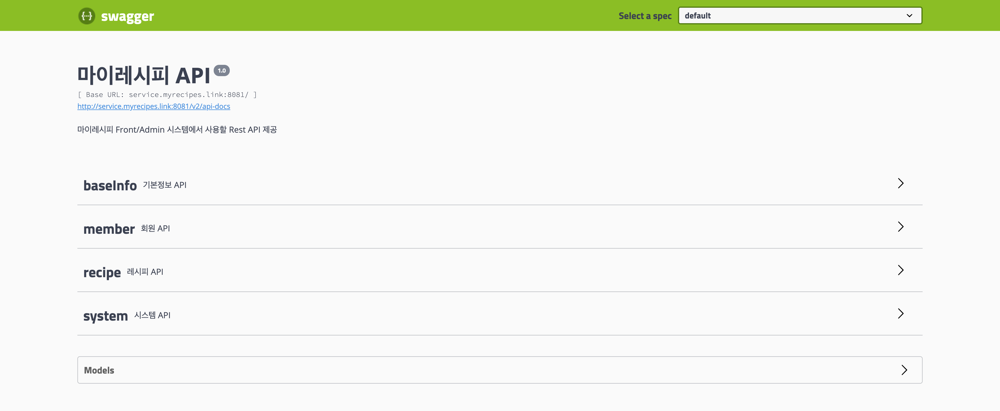
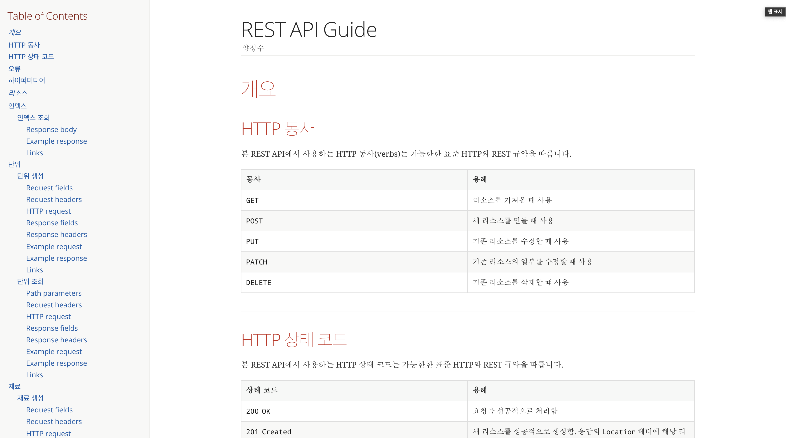

# MY.레시피 API

## 프로젝트 소개

MY.레시피 시스템에서 레시피, 회원 관련 REST API를 제공합니다.

새로운 기술을 적용하고 학습을 하기 위한 프로젝트입니다.

### Swagger

### REST Docs

### 프로젝트 구성

[프로젝트 전체 구성 확인](https://jsyang-dev.github.io/2019/12/19/myrecipes.html)

## 시작하기

## 사용기술

* [Spring Boot](https://spring.io/projects/spring-boot)
* [MySQL](https://www.mysql.com/)
* [Redis](https://redis.io/)
* [RabbitMQ](https://www.rabbitmq.com/)
* [MongoDB](https://www.mongodb.com/)